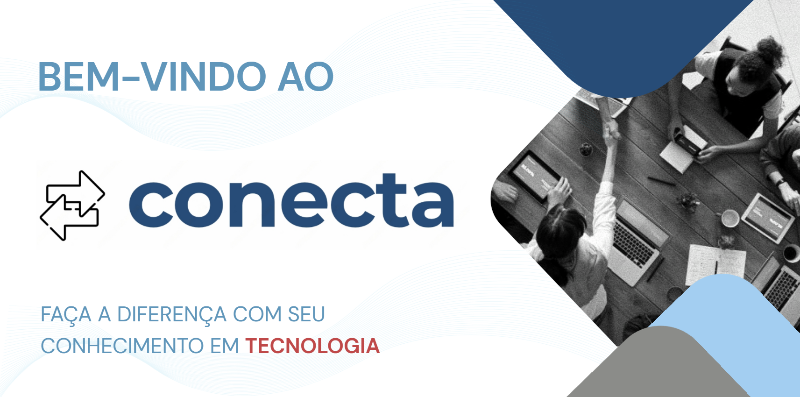

# 6. Apresentação do Projeto

O projeto Conecta tem como objetivo facilitar a interação entre Organizações Não Governamentais (ONGs) e voluntários de tecnologia da informação (TI), criando uma plataforma em que ONGs possam solicitar suporte técnico especializado e voluntários possam oferecer suas habilidades para atender essas demandas. A plataforma busca otimizar a comunicação, o acompanhamento de projetos e o compartilhamento de feedbacks, promovendo um impacto positivo na transformação digital das ONGs.

Link para a apresentação em PDF: 
[Apresentação Conecta em PDF](assets/apresentacao/apresentacao-conecta-PDF.pdf)

Link para a apresentação em PowerPoint: 
[Apresentação Conecta em PowerPoint](assets/apresentacao/apresentacao-conecta-powerpoint.pptx)

Link para a apresentação em vídeo: 
[Apresentação Conecta em vídeo](https://sgapucminasbr-my.sharepoint.com/personal/954530_sga_pucminas_br/_layouts/15/guestaccess.aspx?share=EorqmNKRP9NJmnwJFVgu0RQBF_01xuTO98iMYmqghKTwXQ&e=6mLCqA)

