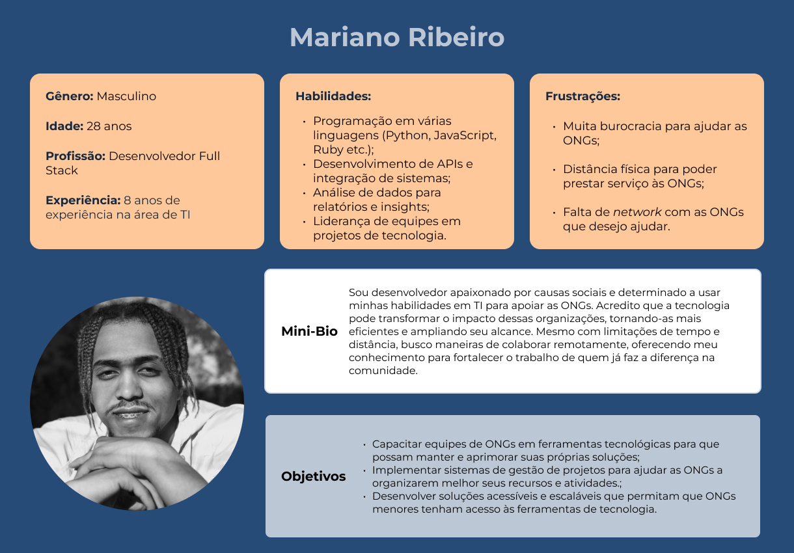
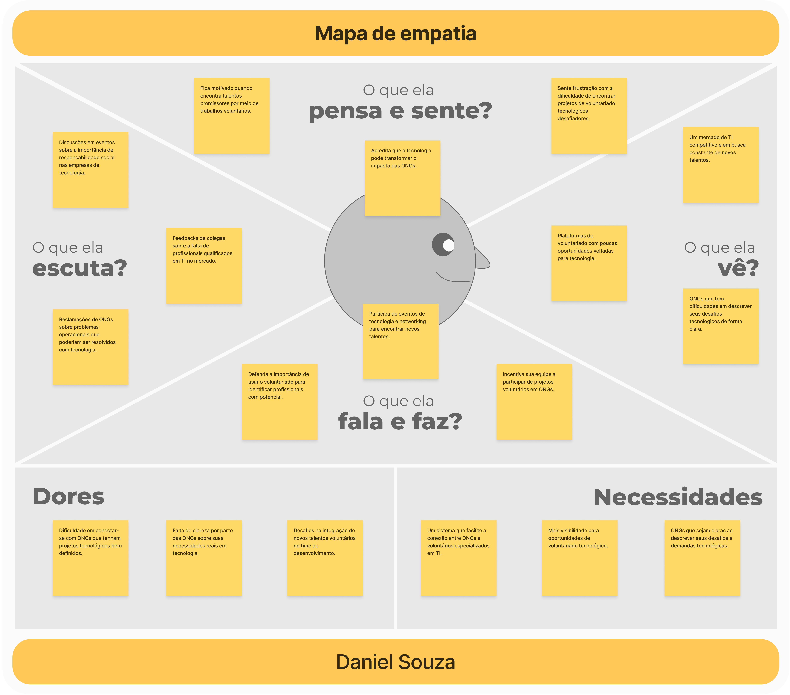
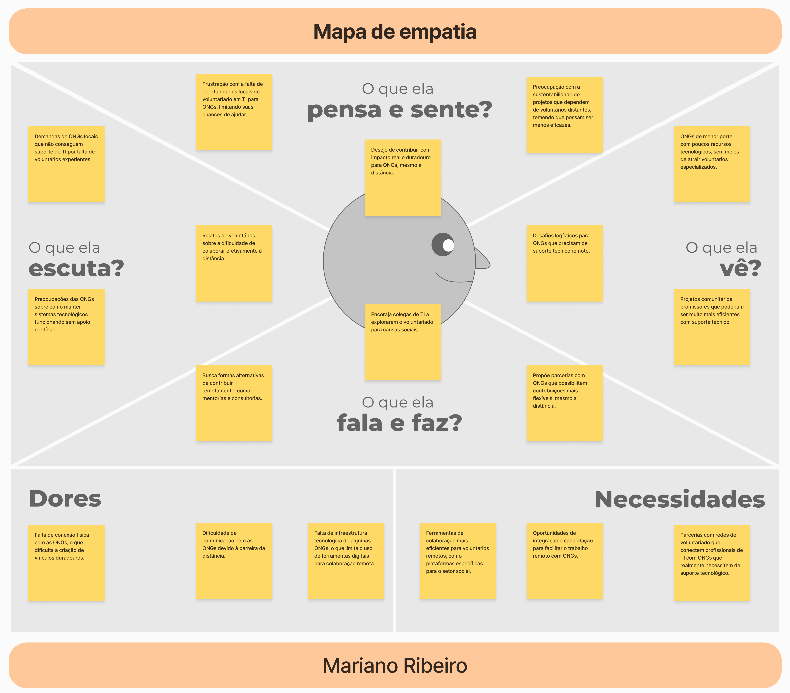
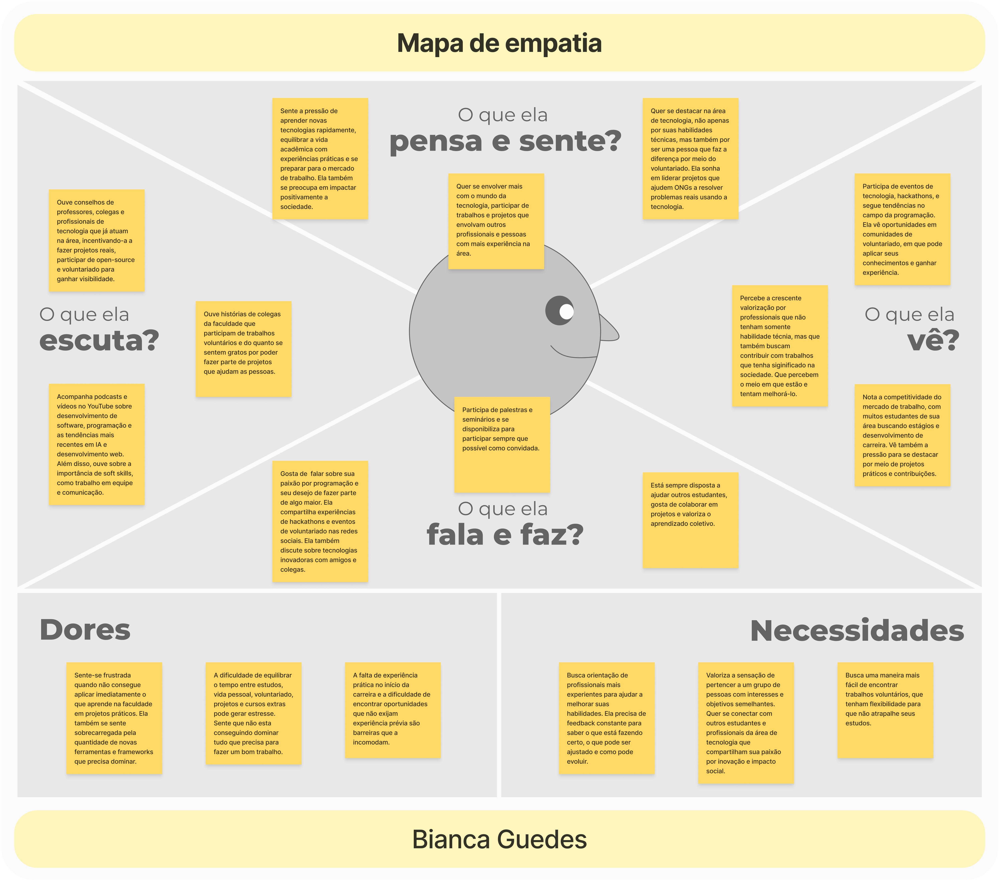
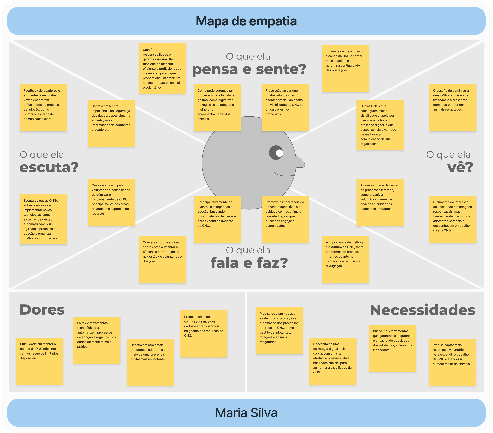
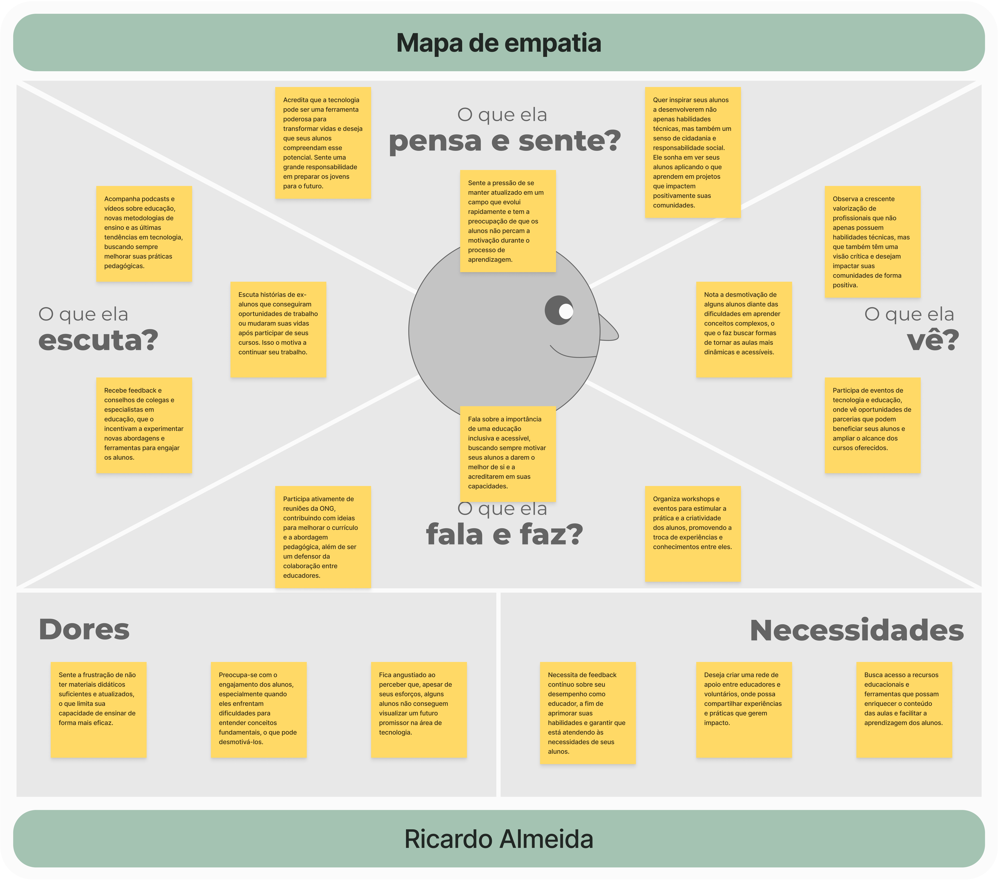
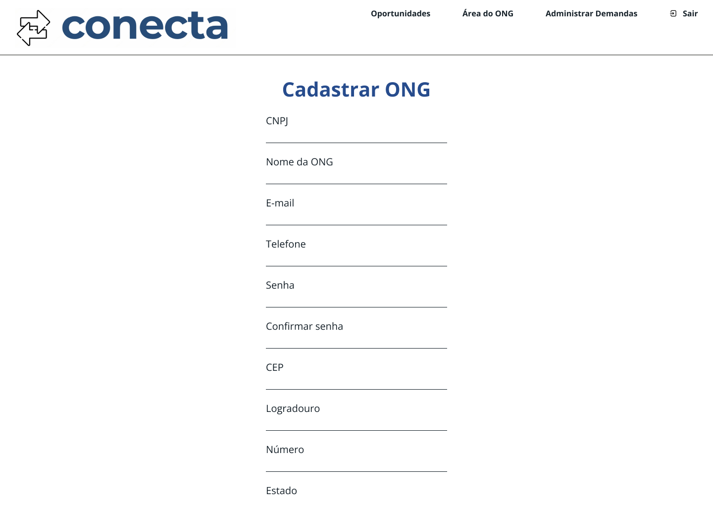
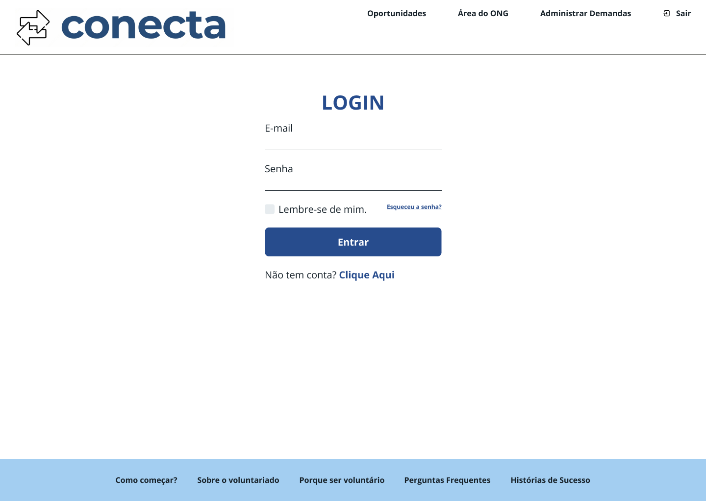
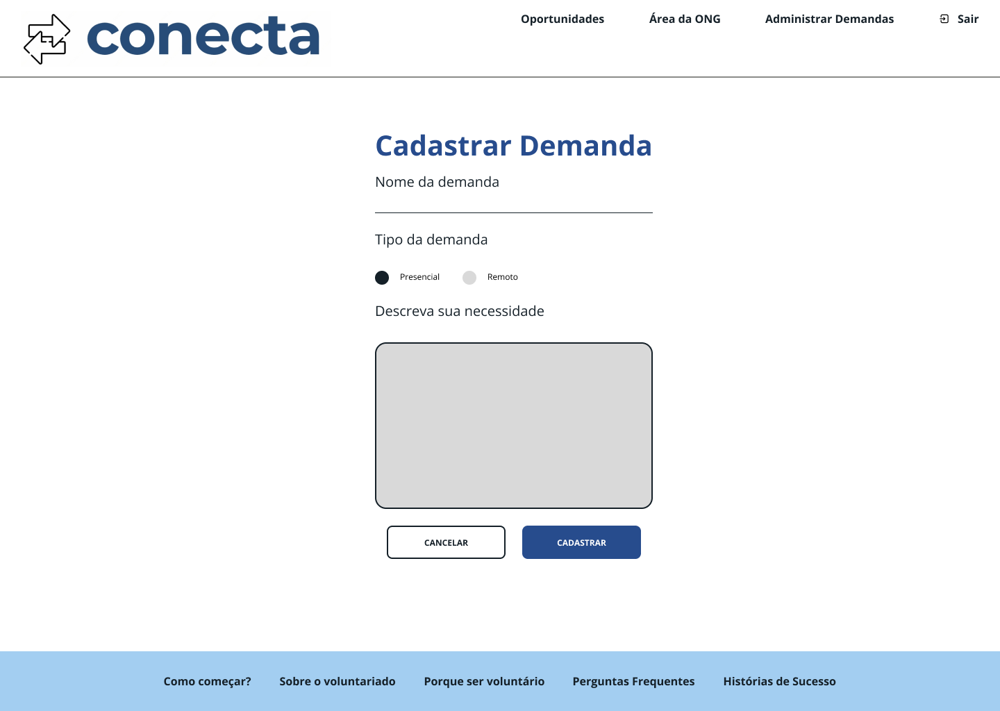

# 4. PROJETO DO DESIGN DE INTERAÇÃO

## 4.1 Personas

### Persona 1: Daniel Souza

### Persona 2: Mariano Ribeiro

### Persona 3: Bianca Guedes

### Persona 4: Maria Silva

### Persona 5: Ricardo Almeida

## 4.2 Mapa de Empatia

### Mapa de Empatia 1: Daniel Souza

### Mapa de Empatia 2: Mariano Ribeiro

### Mapa de Empatia 3: Bianca Guedes

### Mapa de Empatia 4: Maria Silva

### Mapa de Empatia 5: Ricardo Almeida

## 4.3 Protótipos das Interfaces

Nesta seção serão apresentados os protótipos de alta fidelidade do sistema Conecta.

### Página Inicial

#### Objetivo:

A Landing Page foi projetada para reunir todas as funcionalidades do projeto, apresentando de forma clara e atrativa as oportunidades de voluntariado já registradas.

#### Leis de Gestalt aplicadas:

- Lei da Semelhança: aplicada na seção de cards, em que os elementos compartilham cores, formas e fontes semelhantes;

- Lei da Proximidade: presente tanto na seção de cards quanto na seção de imagens. Os elementos relacionados são agrupados de forma a criar uma conexão visual;

- Lei da Continuidade: a página apresenta um fluxo vertical claro, guiando o olhar do usuário de uma seção para outra;

- Lei da Unidade: todos os elementos da tela, como cabeçalho, seções e rodapé, seguem uma estilização semelhante, proporcionando uma aparência coesa;

- Lei da Unificação: o design geral da página transmite uma sensação de harmonia, em que cada elemento visual se complementa e colabora para uma mensagem clara.

- Lei da Segregação: embora as seções compartilhem estilizações semelhantes, o design garante que cada seção seja visualmente distinta, permitindo ao usuário diferenciar claramente entre os blocos de conteúdo.

### Página de "Como começar?"

#### Objetivo:

A página "Como Começar?" foi projetada para orientar os usuários do sistema de maneira clara e objetiva, oferecendo um guia passo a passo para iniciar suas atividades. O conteúdo é segmentado em duas visões distintas: a do voluntário e a do representante da ONG, garantindo que cada perfil de usuário receba informações específicas e adequadas às suas necessidades para uma navegação mais intuitiva e eficiente no sistema.

#### Leis de Gestalt aplicadas:

- Lei de Semelhança: aplicada na seção de guia, em que mesmo sendo dois tipos de usuários, os elementos compartilham fontes e cores;

- Lei da Proximidade: presente tanto na seção de títulos quanto na seção de guias. Os elementos relacionados são agrupados de forma a criar uma conexão visual;

- Lei da Continuidade: a página segue um fluxo vertical intuitivo, guiando o olhar do usuário de uma seção para a outra de maneira suave e natural, sem interrupções visuais, garantindo uma experiência de leitura agradável.

- Lei da Unidade: todos os elementos da tela, como cabeçalho, seções e rodapé, seguem uma estilização semelhante, proporcionando uma aparência coesa;

- Lei da Unificação: o design geral da página transmite uma sensação de harmonia, em que cada elemento visual se complementa e colabora para uma mensagem clara.

### Página "Sobre o Voluntariado"

#### Objetivo:

A página "Sobre o Voluntariado" foi desenvolvida para fornecer aos voluntários uma compreensão clara e objetiva sobre o papel e a importância de suas ações. Ela destaca o impacto positivo que o voluntariado pode gerar tanto na comunidade quanto na vida pessoal de quem se envolve, inspirando o voluntário a reconhecer o valor de sua contribuição e os benefícios transformadores que podem vivenciar ao participar do programa.

#### Leis de Gestalt aplicadas:

- Lei da Continuidade: a página segue um fluxo vertical intuitivo, guiando o olhar do usuário de uma seção para a outra de maneira suave e natural, sem interrupções visuais, garantindo uma experiência de leitura agradável;

- Lei da Unidade: todos os elementos da tela, como cabeçalho, seções e rodapé, seguem uma estilização semelhante, proporcionando uma aparência coesa;

- Lei da Unificação: o design geral da página transmite uma sensação de harmonia, em que cada elemento visual se complementa e colabora para uma mensagem clara.

### Página "Porque ser voluntário?"

#### Objetivo:

A página "Porque ser voluntário?" foi criada para oferecer aos voluntários uma visão clara e objetiva sobre como suas habilidades podem ser aplicadas para gerar impacto positivo na sociedade. Além disso, ela destaca os benefícios que o voluntariado traz para a vida profissional e pessoal, mostrando como essa prática pode desenvolver competências, ampliar redes de contato e promover o crescimento pessoal e profissional dos voluntários.

#### Leis de Gestalt aplicadas:

- Lei da Continuidade: a página segue um fluxo vertical intuitivo, guiando o olhar do usuário de uma seção para a outra de maneira suave e natural, sem interrupções visuais, garantindo uma experiência de leitura agradável;

- Lei da Unidade: todos os elementos da tela, como cabeçalho, seções e rodapé, seguem uma estilização semelhante, proporcionando uma aparência coesa;

- Lei da Unificação: o design geral da página transmite uma sensação de harmonia, em que cada elemento visual se complementa e colabora para uma mensagem clara.

### Página de "Perguntas Frequentes"

#### Objetivo:

A página "Perguntas Frequentes" foi desenvolvida para fornecer aos usuários um conjunto de informações essenciais de forma clara e direta, facilitando o acesso às respostas para as dúvidas mais comuns relacionadas ao projeto. Seu objetivo é otimizar a experiência do usuário, permitindo que ele encontre rapidamente soluções para suas questões sem precisar de suporte adicional.

#### Leis de Gestalt aplicadas:

- Lei da Semelhança: aplicada na seção de perguntas, em que os elementos compartilham uma aparência consistente, indicando que todas as perguntas podem ser expandidas para revelar as respostas, facilitando a identificação e interação;

- Lei da Proximidade: utilizada para agrupar perguntas relacionadas, posicionando-as próximas umas das outras de forma a criar uma conexão visual;

- Lei da Continuidade: a página segue um fluxo vertical intuitivo, guiando o olhar do usuário de uma seção para a outra de maneira suave e natural, sem interrupções visuais, garantindo uma experiência de leitura agradável;

- Lei da Unidade: todos os elementos da tela, como cabeçalho, seções e rodapé, seguem uma estilização semelhante, proporcionando uma aparência coesa;

- Lei da Unificação: o design geral da página transmite uma sensação de harmonia, em que cada elemento visual se complementa e colabora para uma mensagem clara.

### Página de "Histórias de Sucesso"

#### Objetivo:

A página "Histórias de Sucesso" foi criada para inspirar e motivar os usuários, apresentando histórias reais de voluntários e ONGs que utilizaram a aplicação com sucesso. O objetivo é incentivar voluntários a disponibilizarem suas habilidades para ONGs, enquanto também encoraja as ONGs a se abrirem para novos voluntários, especialmente no campo da tecnologia, promovendo colaboração e impacto social.

#### Leis de Gestalt aplicadas:

- Lei da Semelhança: aplicada na seção de histórias, em que os elementos compartilham uma aparência consistente, facilitando a leitura e compreensão;

- Lei da Proximidade: utilizada para agrupar as imagens e as respectivas histórias de cada voluntário ou representante de ONG;

- Lei da Continuidade: a página segue um fluxo vertical intuitivo, guiando o olhar do usuário de uma seção para a outra de maneira suave e natural, sem interrupções visuais, garantindo uma experiência de leitura agradável;

- Lei da Unidade: todos os elementos da tela, como cabeçalho, seções e rodapé, seguem uma estilização semelhante, proporcionando uma aparência coesa;

- Lei da Unificação: o design geral da página transmite uma sensação de harmonia, em que cada elemento visual se complementa e colabora para uma mensagem clara.

### Página de oportunidades

#### Objetivo:

O objetivo da página de oportunidades é apresentar para os usuários todos os trabalhos de voluntariado que as ONGs cadastraram no sistema.

#### Leis de Gestalt aplicadas:

- Lei da Proximidade: os cartões com as oportunidades estão próximos uns dos outros, o que indica que eles pertencem ao mesmo grupo de informações. A proximidade faz com que os elementos sejam percebidos como relacionados;

- Lei da Semelhança: todos os cartões têm o mesmo formato, cor de fundo e estrutura. Criando um sentido de unidade e facilitando o reconhecimento de que todas essas caixas representam diferentes oportunidades;

- Lei da Continuidade: o layout segue uma organização em grade, permitindo que os olhos sigam naturalmente a sequência de informações de cima para baixo e da esquerda para a direita, o que facilita a leitura e a navegação;

- Lei do Fechamento: a identidade visual do site, com ícones e formas simples, sugere formas completas, mesmo que algumas estejam apenas parcialmente representadas, como o logotipo ou ícones das ONGs.

### Cadastrar ONG

#### Objetivo:

A página de cadastramento das ONGs tem o objetivo de permitir que as ONGs realizem seu cadastro com informações relevantes sobre seu perfil.

#### Leis de Gestalt aplicadas:

- Lei da Proximidade: os campos de entrada relacionados como nome, e-mail, telefone estão organizados próximos uns dos outros, formando grupos lógicos. Isso ajuda a agrupar mentalmente informações correlatas, facilitando o preenchimento do formulário;

- Lei da Similaridade: todos os campos seguem um mesmo padrão visual, com linhas e rótulos semelhantes, o que reforça a ideia de que fazem parte de um mesmo conjunto de ações;

- Lei da Continuidade: a disposição vertical dos campos segue uma linha contínua, guiando naturalmente o olhar de cima para baixo, o que facilita a navegação por formulários longos e o processo de preenchimento.

### Login

#### Objetivo:

O objetivo da página de login é possibilitar que os usuários (ONGs e voluntários) acessem o sistema.

#### Leis de Gestalt aplicadas:

- Lei da Proximidade: os campos de e-mail e senha estão próximos um do outro, indicando que são relacionados e parte do mesmo processo de login;

- Lei da Similaridade: os links no topo e no rodapé da página têm um estilo visual semelhante, o que ajuda a agrupá-los como elementos de navegação;

- Lei do Fechamento: mesmo que os campos de entrada não tenham bordas completas, eles possuem a aparência de caixas completas devido à disposição dos elementos;

- Lei da Continuidade: a disposição linear dos campos de entrada e botões segue uma linha contínua, facilitando a navegação visual.

### Página da ONG

#### Objetivo:

Objetivo

#### Leis de Gestalt aplicadas:

- Lei da Proximidade: os elementos que estão próximos uns dos outros, como os textos e seus respectivos títulos, são percebidos como grupos relacionados;

- Lei da Similaridade: os textos e títulos que compartilham o mesmo estilo e formatação são vistos como parte de um mesmo grupo ou categoria;

- Lei da Continuidade: a disposição linear dos textos e títulos cria uma sensação de continuidade, guiando o olhar do usuário de forma fluida pela página;

- Lei do Fechamento: mesmo que alguns elementos não estejam completamente delineados, nossa mente tende a completar as formas, percebendo-os como unidades completas.

### Cadastrar Demanda

#### Objetivo:

A página de cadastrar demanda permite que as ONGs cadastrem os trabalhos de voluntariado na plataforma.

#### Leis de Gestalt aplicadas:

- Lei da Proximidade: os campos de entrada e seus rótulos estão próximos uns dos outros, indicando que são relacionados e parte do mesmo formulário;

- Lei da Similaridade: os botões “Presencial” e “Remoto” têm um estilo visual semelhante, sugerindo que são opções dentro da mesma categoria;

- Lei da Continuidade: a disposição linear dos campos de entrada e botões cria uma sensação de continuidade, guiando o olhar do usuário de forma fluida pela página.

### Administrar Demandas

#### Objetivo:

O objetivo da página de administrar demandas é permitir que as ONGs editem as informações da demanda, podendo consultar, revisar, editar ou excluir.

#### Leis de Gestalt aplicadas:

- Lei da Proximidade: os elementos que estão próximos uns dos outros, como os cartões e seus respectivos botões, são percebidos como grupos relacionados;

- Lei da Similaridade: os cartões têm um design semelhante, com ícones, títulos e botões que compartilham o mesmo estilo visual, agrupando-os visualmente;

- Lei da Figura-Fundo: os cartões se destacam como figuras contra o fundo branco, tornando claro quais elementos são interativos.
