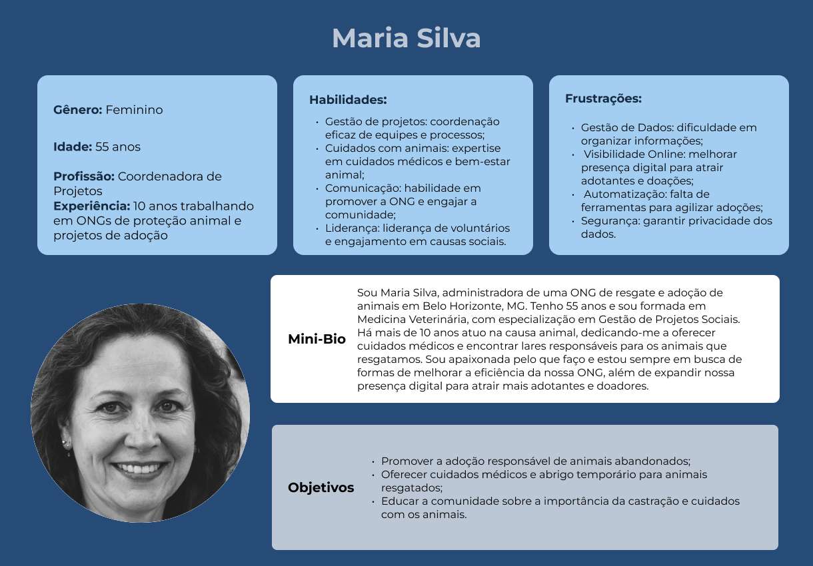
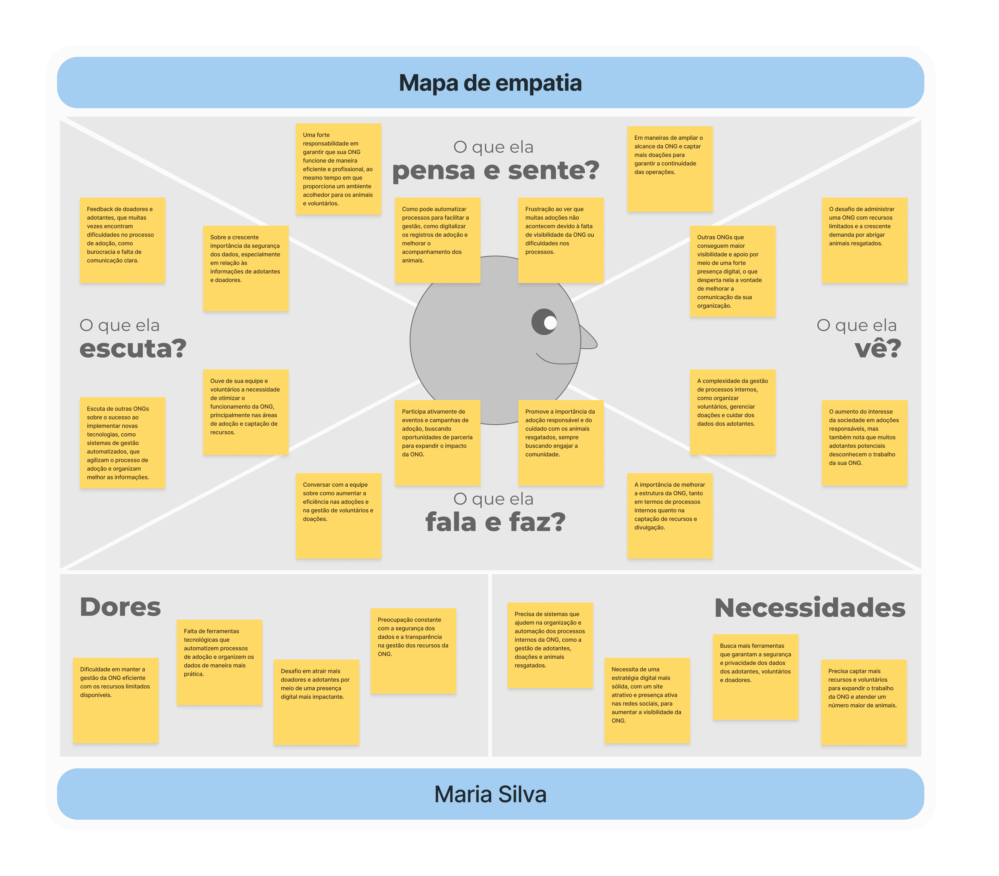
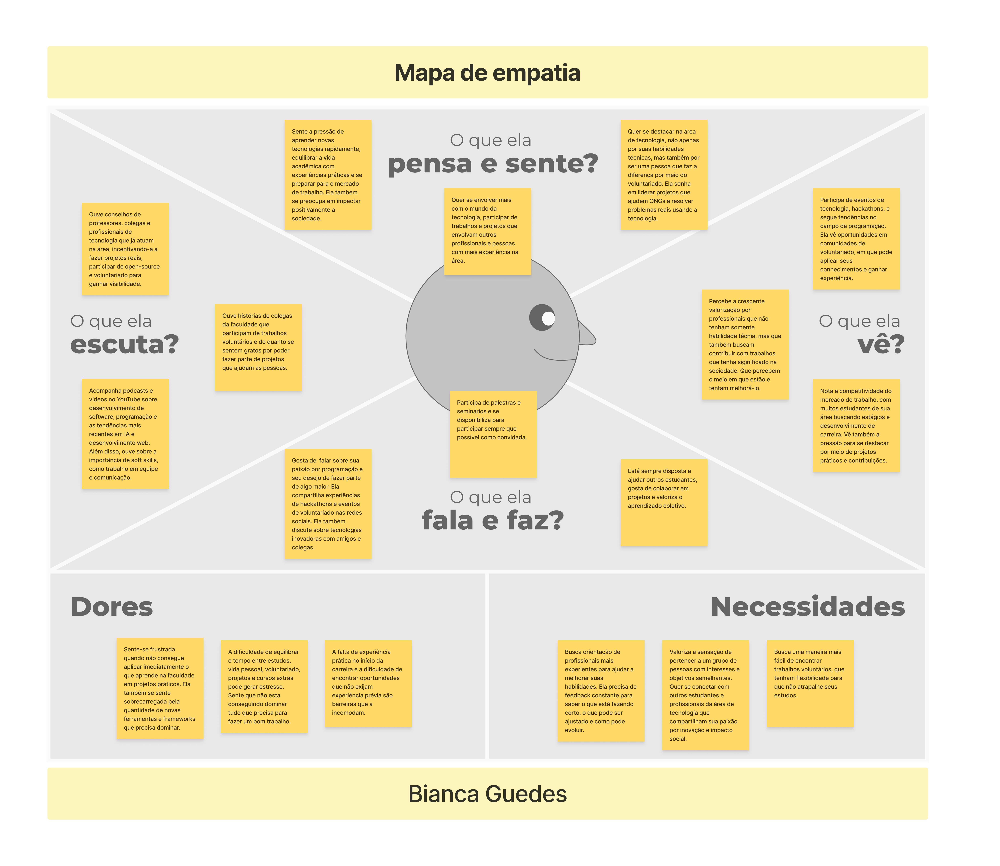
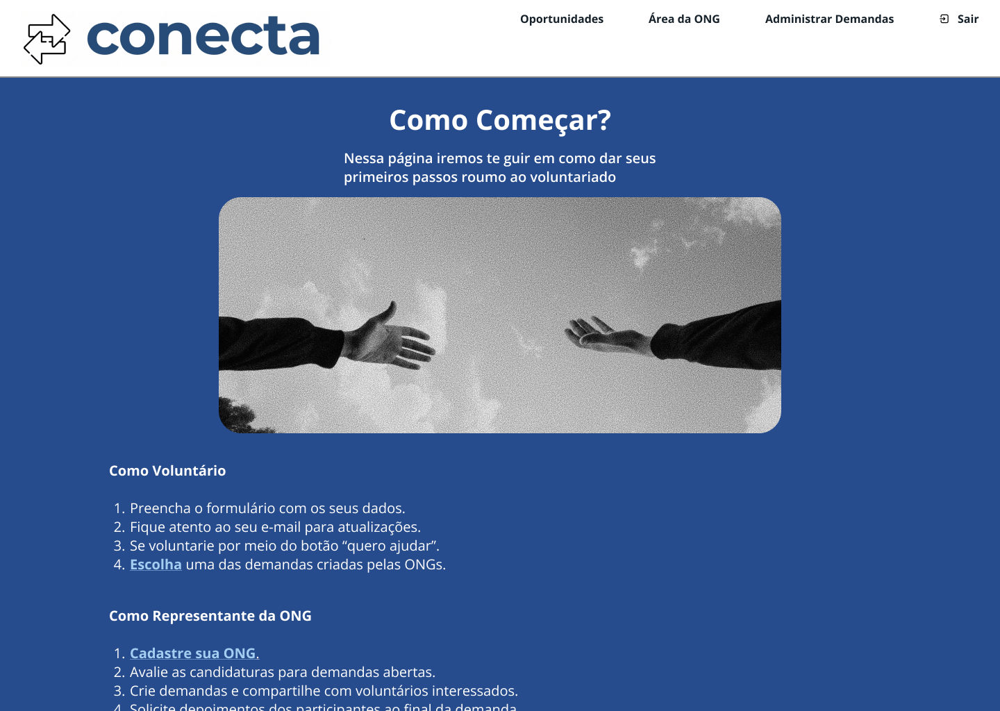
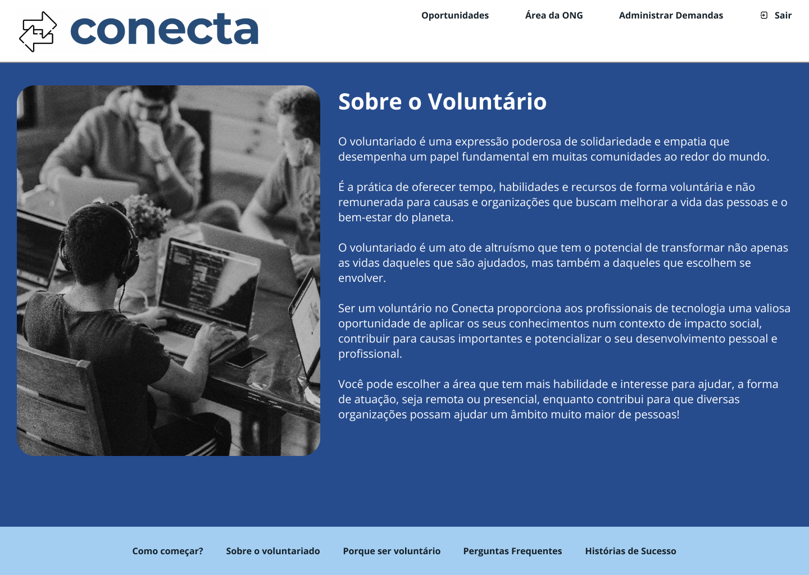
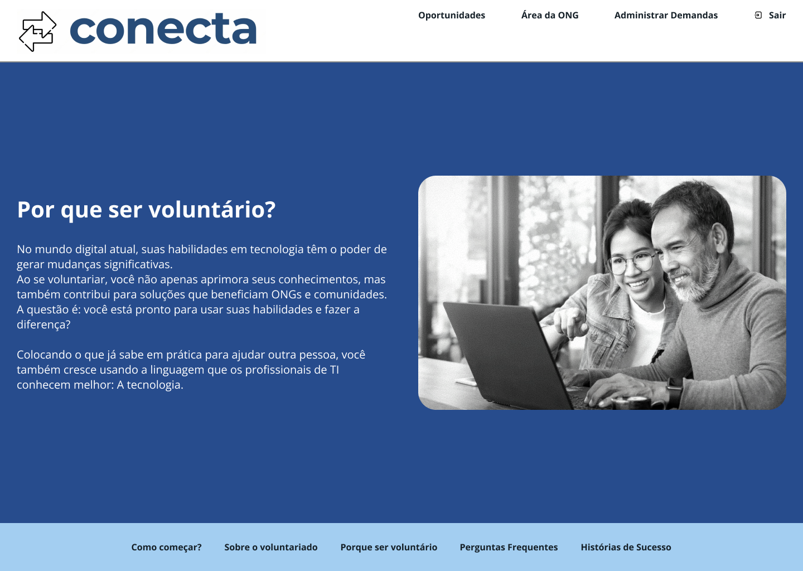
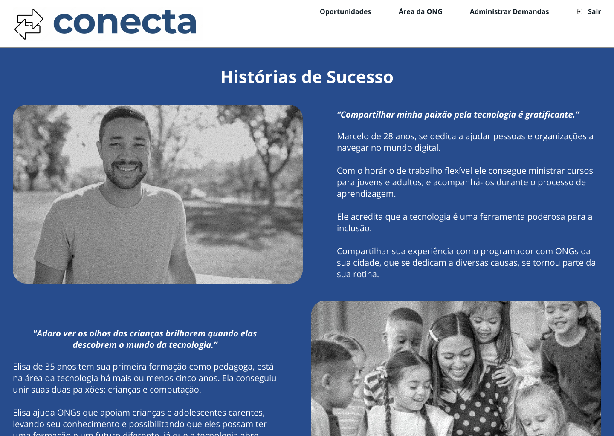
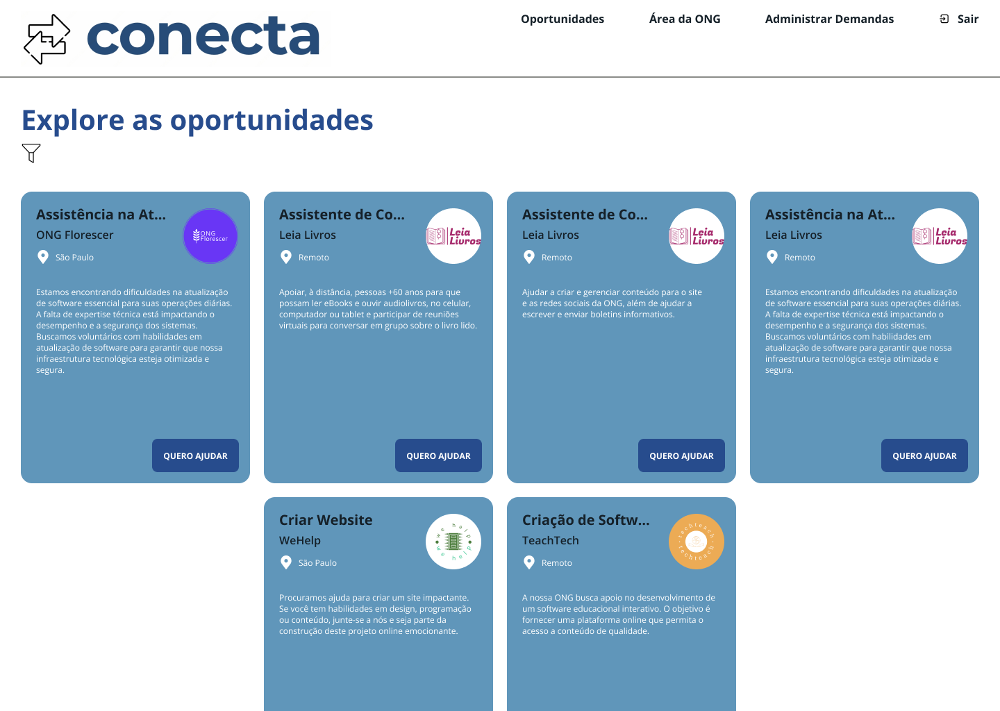
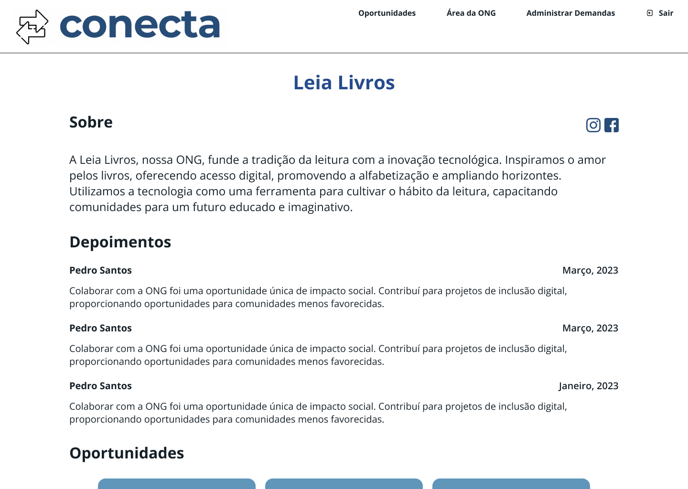
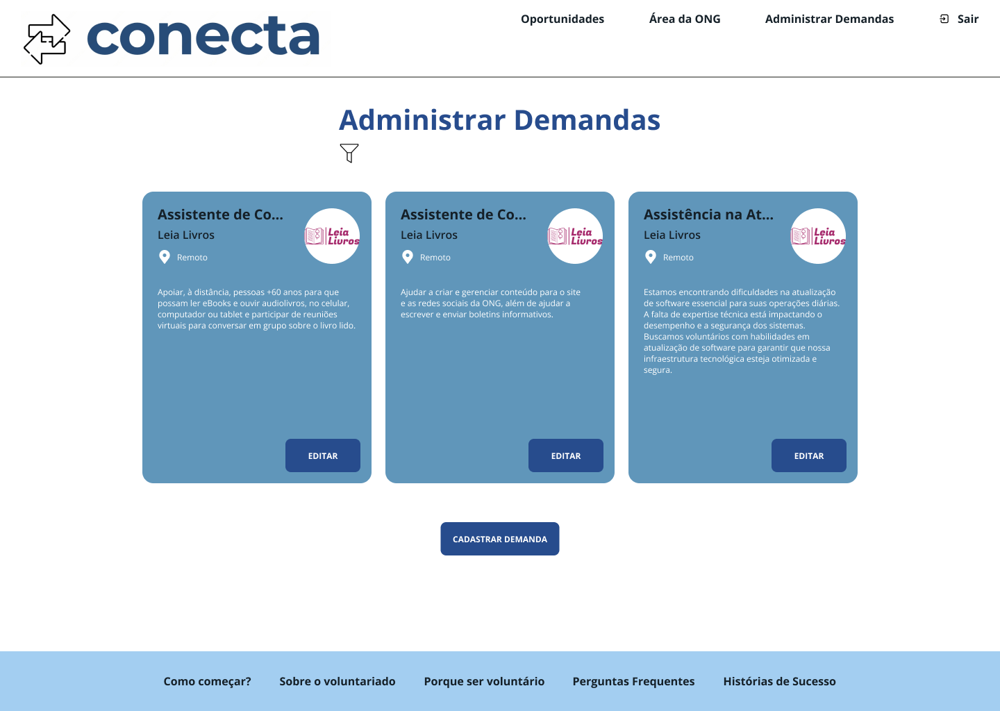

# 4. PROJETO DO DESIGN DE INTERAÇÃO

## 4.1 Personas

### Persona 1: Maria Silva

### Persona 3: Bianca Guedes

## 4.2 Mapa de Empatia

### Mapa de Empatia 1: Maria Silva

### Mapa de Empatia 3: Bianca Guedes

## 4.3 Protótipos das Interfaces

Nesta seção serão apresentados os protótipos de alta fidelidade do sistema Conecta.

### Página Inicial

#### Objetivo:

A Landing Page foi projetada para reunir todas as funcionalidades do projeto, apresentando de forma clara e atrativa as oportunidades de voluntariado já registradas.

#### Leis de Gestalt aplicadas:

- Lei da Semelhança: utilizada na seção de cards, onde os elementos compartilham cores, formas e fontes semelhantes;

- Lei da Proximidade: presente tanto na seção de cards quanto na seção de imagens. Os elementos relacionados são agrupados de forma a criar uma conexão visual;

- Lei da Continuidade: a página apresenta um fluxo vertical claro, guiando o olhar do usuário de uma seção para outra;

- Lei da Unidade: todos os elementos da tela, como cabeçalho, seções e rodapé, seguem uma mesma estilização, proporcionando uma aparência coesa;

- Lei da Unificação: o design geral da página transmite uma sensação de harmonia, onde cada elemento visual se complementa e colabora para uma mensagem clara.

### Como começar?

#### Objetivo:

Objetivo

#### Leis de Gestalt aplicadas:

- ...
- ...

### Sobre o Voluntariado

#### Objetivo:

Objetivo

#### Leis de Gestalt aplicadas:

- ...
- ...

### Por que ser voluntário

#### Objetivo:

Objetivo

#### Leis de Gestalt aplicadas:

- ...
- ...

### Perguntas Frequentes

#### Objetivo:

Objetivo

#### Leis de Gestalt aplicadas:

- ...
- ...

### Histórias de Sucesso

#### Objetivo:

Objetivo

#### Leis de Gestalt aplicadas:

- ...
- ...

### Página de oportunidades

#### Objetivo:

O objetivo da página de oportunidades é apresentar para os usuários todos os trabalhos de voluntariado que as ONGs cadastraram no sistema.

#### Leis de Gestalt aplicadas:

- Lei da Proximidade: os cartões com as oportunidades estão próximos uns dos outros, o que indica que eles pertencem ao mesmo grupo de informações. A proximidade faz com que os elementos sejam percebidos como relacionados;

- Lei da Semelhança: todos os cartões têm o mesmo formato, cor de fundo e estrutura. Criando um sentido de unidade e facilitando o reconhecimento de que todas essas caixas representam diferentes oportunidades;

- Lei da Continuidade: o layout segue uma organização em grade, permitindo que os olhos sigam naturalmente a sequência de informações de cima para baixo e da esquerda para a direita, o que facilita a leitura e a navegação;

- Lei do Fechamento: a identidade visual do site, com ícones e formas simples, sugere formas completas, mesmo que algumas estejam apenas parcialmente representadas, como o logotipo ou ícones das ONGs.

### Cadastrar ONG

#### Objetivo:

A página de cadastramento das ONGs tem o objetivo de permitir que as ONGs realizem seu cadastro com informações relevantes sobre seu perfil.

#### Leis de Gestalt aplicadas:

- Lei da Proximidade: os campos de entrada relacionados como nome, e-mail, telefone estão organizados próximos uns dos outros, formando grupos lógicos. Isso ajuda a agrupar mentalmente informações correlatas, facilitando o preenchimento do formulário;

- Lei da Similaridade: todos os campos seguem um mesmo padrão visual, com linhas e rótulos semelhantes, o que reforça a ideia de que fazem parte de um mesmo conjunto de ações;

- Lei da Continuidade: a disposição vertical dos campos segue uma linha contínua, guiando naturalmente o olhar de cima para baixo, o que facilita a navegação por formulários longos e o processo de preenchimento.

### Login

#### Objetivo:

O objetivo da página de login é possibilitar que os usuários (ONGs e voluntários) acessem o sistema.

#### Leis de Gestalt aplicadas:

- Lei da Proximidade: os campos de e-mail e senha estão próximos um do outro, indicando que são relacionados e parte do mesmo processo de login;

- Lei da Similaridade: os links no topo e no rodapé da página têm um estilo visual semelhante, o que ajuda a agrupá-los como elementos de navegação;

- Lei do Fechamento: mesmo que os campos de entrada não tenham bordas completas, nossa mente os percebe como caixas completas devido à disposição dos elementos;

- Lei da Continuidade: a disposição linear dos campos de entrada e botões segue uma linha contínua, facilitando a navegação visual.

### Página da ONG

#### Objetivo:

Objetivo

#### Leis de Gestalt aplicadas:

- Lei da Proximidade: os elementos que estão próximos uns dos outros, como os textos e seus respectivos títulos, são percebidos como grupos relacionados;

- Lei da Similaridade: os textos e títulos que compartilham o mesmo estilo e formatação são vistos como parte de um mesmo grupo ou categoria;

- Lei da Continuidade: a disposição linear dos textos e títulos cria uma sensação de continuidade, guiando o olhar do usuário de forma fluida pela página;

- Lei do Fechamento: mesmo que alguns elementos não estejam completamente delineados, nossa mente tende a completar as formas, percebendo-os como unidades completas.

### Cadastrar Demanda

#### Objetivo:

Objetivo

#### Leis de Gestalt aplicadas:

- ...
- ...

### Administrar Demandas

#### Objetivo:

Objetivo

#### Leis de Gestalt aplicadas:

- ...
- ...
