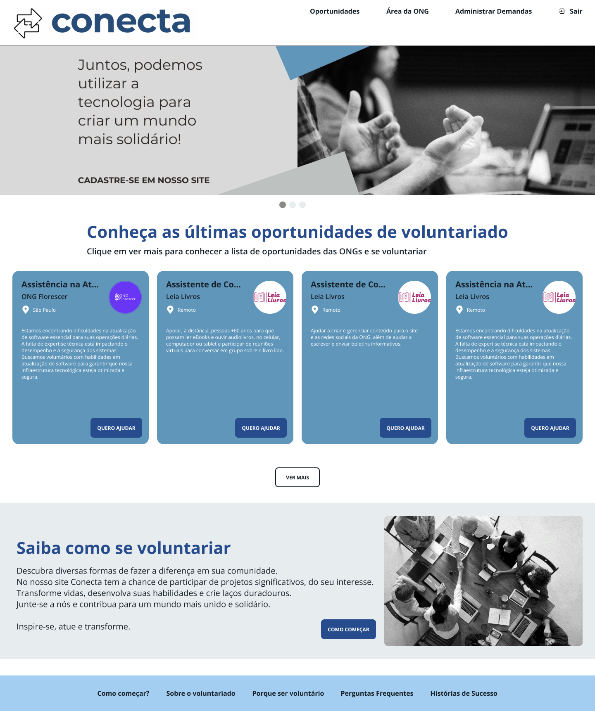
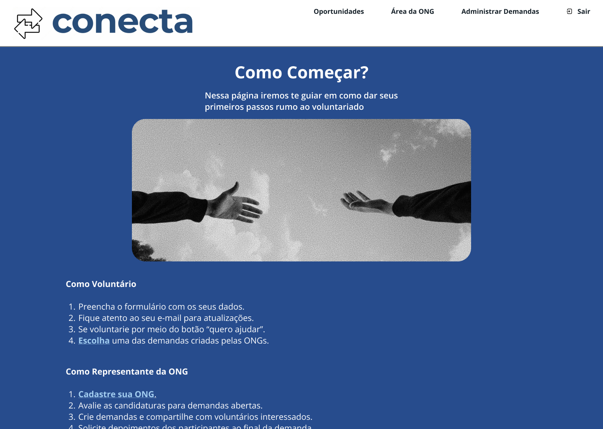

# 4. PROJETO DO DESIGN DE INTERAÇÃO

## 4.1 Personas

### Persona 1: Maria Silva

### Persona 3: Bianca Guedes

## 4.2 Mapa de Empatia

### Mapa de Empatia 1: Maria Silva

### Mapa de Empatia 3: Bianca Guedes

# 4.3 Protótipos das Interfaces

## Considerações Sobre a Prototipação

Neste projeto, as leis da Gestalt e as regras de design são cuidadosamente incorporadas em todas as páginas. A seguir, destacamos as leis e regras aplicadas:

### Leis de Gestalt

#### Lei da Semelhança

Os elementos visuais, como botões, textos, links e campos de entrada, utilizam estilos semelhantes (cor, forma e tipografia) para facilitar a identificação e interação pelo usuário.

#### Lei da Proximidade

Os campos de entrada e os botões de ação estão posicionados próximos e alinhados com o conteúdo distribuído pela tela, melhorando a usabilidade e ajudando na relação visual entre os elementos.

#### Lei da Continuidade

A disposição dos elementos segue um fluxo vertical, guiando o olhar do usuário através da interface de maneira intuitiva.

#### Lei da Unidade

Todas as páginas compartilham uma paleta de cores e estilos consistentes, criando uma identidade visual coesa e ajudando o usuário a perceber que, apesar das diferentes funcionalidades, ainda está no mesmo sistema.

#### Lei da Unificação

Elementos distintos são organizados de forma a manter uma coesão visual, promovendo uma experiência de uso harmoniosa.

#### Lei da Segregação

Elementos que precisam ser destacados, como mensagens de erro ou avisos, são visualmente separados do conteúdo principal por meio de contraste de cores e espaçamento.

### Regras de Design

1. **Mantenha a Consistência:**  
   Elementos similares são usados de forma consistente em todo o projeto, permitindo que os usuários aprendam rapidamente a interface.

2. **Forneça Feedback:**  
   O sistema oferece respostas claras para as ações do usuário, como mensagens de erro para entradas inválidas, garantindo que o usuário saiba que suas interações foram reconhecidas.

3. **Design para a Visibilidade:**  
   Elementos importantes são destacados e facilmente acessíveis, facilitando a interação e a navegação.

4. **Use uma Hierarquia Visual Clara:**  
   A disposição dos elementos na interface segue uma hierarquia que orienta o usuário sobre onde focar a atenção, utilizando tamanhos de fonte e contrastes apropriados.

5. **Permita a Navegação Fácil:**  
   A navegação é intuitiva e acessível, permitindo que os usuários se movam facilmente entre diferentes seções do projeto.

6. **Seja Previsível:**  
   O design é intuitivo, e as interações são previsíveis, permitindo que os usuários utilizem a interface sem necessidade de um treinamento extenso.

7. **Facilite a Recuperação de Erros:**  
   O sistema oferece sugestões claras para corrigir erros, tornando a recuperação de ações inválidas fácil e direta.

## Prototipação do Projeto

### Página Inicial

### Página de Oportunidades

### Página de Gestão da ONG

### Página de Gestão de Demandas

## Informações Adicionais

### Página de Guia de Primeiros Passos

### Página sobre o Voluntariado

### Página de Motivação para se Voluntariar

### Página de Perguntas Frequentes

### Página de Histórias de Sucesso

